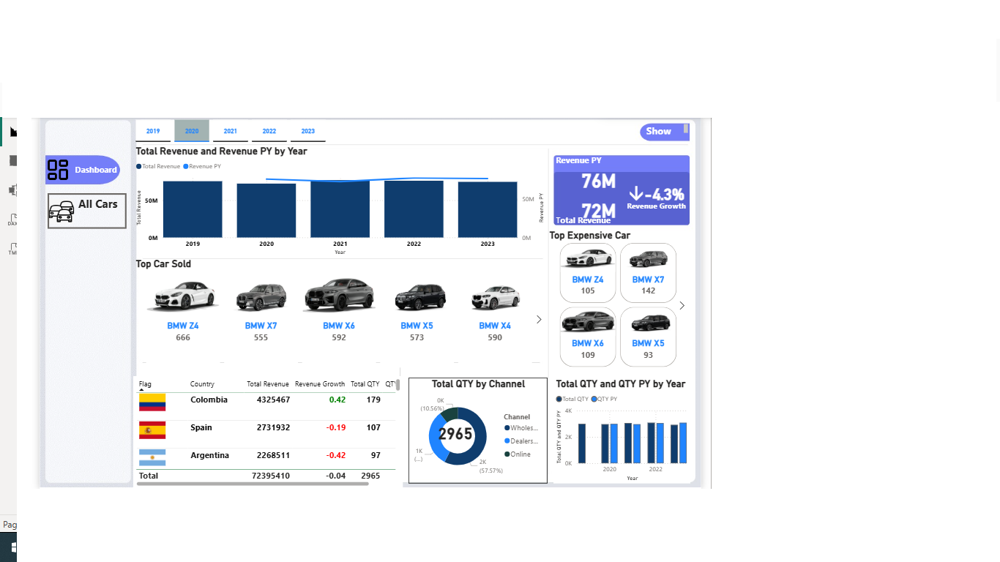
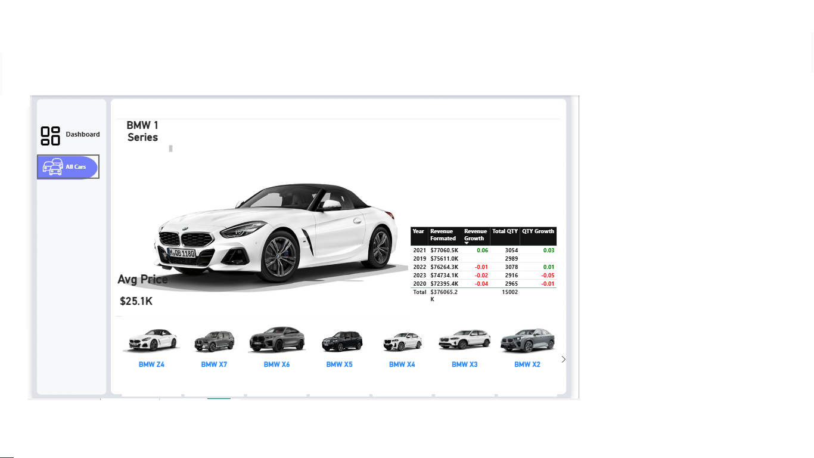

BMW Sales Performance & Market Analysis Dashboard
📌 Project Overview
This project features a comprehensive and interactive Power BI Dashboard designed to analyze the sales performance of BMW car models across multiple years (2019-2023) and global markets. The goal is to provide data-driven insights into revenue trends, quantity sold, and regional performance to support strategic decision-making.

📊 Key Insights
Revenue Growth: The dashboard tracks Year-over-Year (YoY) revenue growth, showing a current revenue of $76M compared to $72M in the previous year (a dynamic growth of -4.3% depending on the selected year).

Top Performing Models: BMW Z4 stands out as a top seller with 666 units sold, followed closely by the BMW X6 and X4.

Regional Performance: Detailed breakdown of revenue by country, highlighting Colombia, Spain, and Argentina as key contributors to total sales.

Sales Channels: Analysis of quantity sold via different channels, showing that Dealers and Wholesale represent the majority of the distribution network (57.57% and 31.87% respectively).

Pricing Strategy: Real-time tracking of average prices (e.g., $25.1K for the 1 Series) and identifying the "Top Expensive Cars" like the BMW X7.

🛠️ Tools & Skills
Power BI Desktop: For data modeling and advanced visualization.

Power Query: Data cleaning and transformation (ETL).

DAX (Data Analysis Expressions): Created complex measures for Revenue PY, Revenue Growth %, and Total Quantity.

Excel: Used as the primary data source for the raw sales records.

Data Storytelling: Designing a user-friendly UI/UX with navigation buttons and clear KPIs.

🖼️ Dashboard Preview
1. Main Executive Dashboard
2. Individual Car Series Analysis
